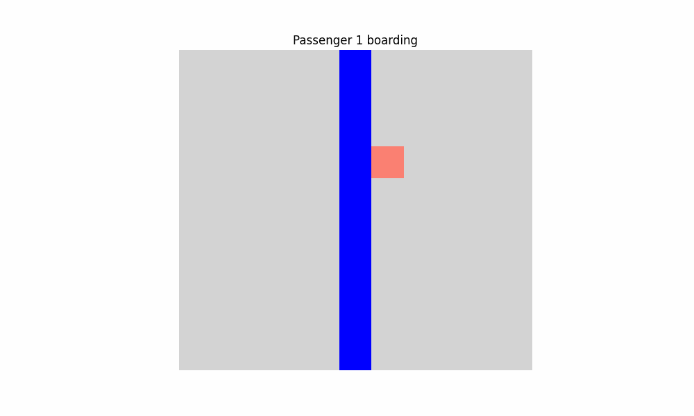

# 100 Seat Airplane Simulation

This project simulates the problem of a 100-seat airplane and tries to understand and analyze the results by visualizing them.

## Table of Contents
- [Problem Description](#problem-description)
- [Features](#features)
- [Installation](#installation)
- [Usage](#usage)
  - [Visualization Mode](#visualization-mode)
  - [Probability Mode](#probability-mode)
- [Results Visualization](#results-visualization)
- [Video Visualization](#video-visualization)
- [Analysis](#analysis)
- [Future Improvements](#future-improvements)
- [Contributions](#contributions)
- [License](#license)

## Problem Description

There are 100 passengers lined up (in a random order) to board a plane. The plane is fully booked, meaning there are exactly 100 seats available. Due to a technical malfunction, the first passenger chooses a seat at random, with all seats equally likely. Each of the other passengers then proceeds as follows: if their assigned seat is free, they will sit in it; otherwise, they will take a random available seat. What is the probability that the last passenger will sit in their assigned seat ?

Before you run the code and see the results, try to solve the problem yourself!
Be careful, it's not a simple question...

## Features

- **Simulation of Passenger Boarding**: Simulates how each passenger boards the airplane and chooses a seat based on availability.
- **Visualization**: Graphical representation of seat occupancy during the boarding process.
- **Probability Calculation**: Calculates the probability of the last passenger sitting in their assigned seat based on multiple trials.
- **Statistical Analysis**: Analyzes and visualizes the distribution of passengers not sitting in their assigned seats.

## Installation

To run this project, make sure you have Python 3 installed along with the necessary libraries:

```bash
pip install -r requirements.txt
```

## Usage

You can run the simulation in two modes: visualization and probability analysis.

1. **Visualization Mode**: This mode provides a visual representation of how passengers board the airplane. In addition to displaying the animation, this mode saves each frame of the simulation as an image in the results/ directory and then compiles them into a GIF for easy sharing and analysis.

   ```bash
   python main.py visualization
   ```

2. **Probability Mode**: This mode runs multiple trials to calculate and display the probability of the last passenger being in their assigned seat, along with additional statistical insights.

   ```bash
   python main.py probability --nb_trials 10000
   ```

   - `--nb_trials`: The number of trials to run for probability calculation (default is 10 000).

Output includes:

Probability that the last passenger is seated in their assigned seat.
Average number of passengers who are not in their assigned seats.
Graphs displaying:
The distribution of the last passenger being seated in their assigned seat (True) or not (False).
The frequency of passengers not in their assigned seats across multiple trials.
The graphs are automatically displayed upon running in this mode and can be saved for analysis.

## Results Visualization


## Video Visualization



## Analysis

The following statistics are displayed after running the probability analysis:
- Probability that the last passenger got their assigned seat.
- Average number of passengers not at their places.
- Distribution of the last passenger's results (at their place or not).
- Distribution of passengers not at their assigned places.

## Future Improvements
- Upgrade the design of the visualization

## Contributions

Feel free to contribute by opening issues or submitting pull requests. Your feedback is welcome!

## License

This project is licensed under the MIT License - see the [LICENSE](LICENSE) file for details.
